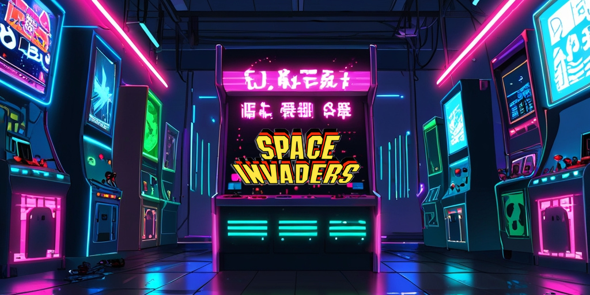

# Space Invaders Game

Este proyecto es una implementación del clásico juego **Space Invaders** desarrollado en **Python**. En este juego, el jugador controla una nave espacial que debe disparar para eliminar las naves enemigas que se acercan. El objetivo es destruir a todas las naves enemigas antes de que alcancen la parte inferior de la pantalla.

## Estructura del Proyecto

- **main.py**: Archivo principal que contiene el código del juego.
- **.idea/**: Carpeta generada por el IDE (como PyCharm).
- **Imagenes**:
  - `astronave.png`: Imagen de la nave controlada por el jugador.
  - `astronave_enemiga.png`: Imagen de las naves enemigas.
  - `bala.png`: Imagen de los disparos de la nave.
  - `photo-space-background.jpg`: Imagen de fondo para el escenario del juego.
- **Sonidos**:
  - `MusicaFondo.mp3`: Música de fondo durante el juego.
  - `Golpe.mp3`: Sonido cuando la nave es golpeada por una bala enemiga.
  - `disparo.mp3`: Sonido de disparo de la nave del jugador.
- **Fuentes**:
  - `CREATED_ATTACHED_DEMO.ttf`: Fuente usada para los textos del juego.
  - `FAST-TRACK.ttf`: Otra fuente usada en el juego.
  
## Instalación

1. Clona este repositorio:

   ```bash
   git clone https://github.com/tu_usuario/space-invaders.git
    ```
   
2. Instación de las dependencias necesarias:

   ```bash
   pip install pygame
    ```
   
3. Ejecución del juego:

   ```bash
   python main.py
    ```
