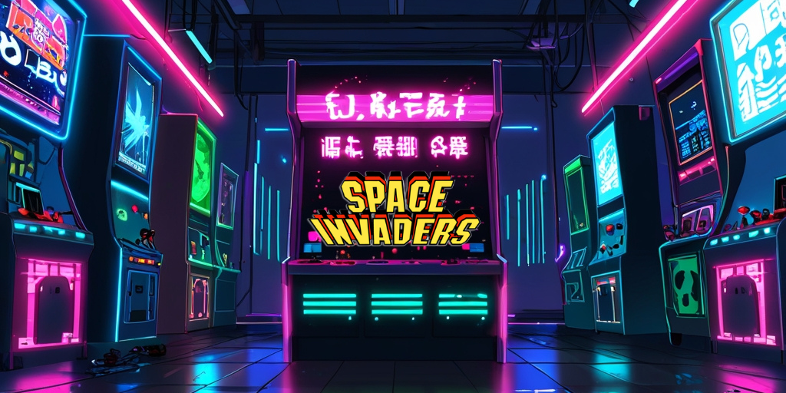

# Space Invaders Game



Implementación web del clásico **Space Invaders** con una base muy ligera: `HTML + CSS + JavaScript` sin dependencias ni build step. El repositorio también conserva una versión histórica en `Python/Pygame` dentro de `legacy/`.

## Resumen

- Juego 2D sobre `canvas` de `800x600`.
- Interfaz retro responsive para escritorio y móvil.
- Lógica principal concentrada en `js/game.js`.
- Persistencia local de récord e historial mediante `localStorage`.
- Despliegue automático a GitHub Pages desde `main`.

## Funcionalidades implementadas

- Pantalla de inicio con overlay y botón de arranque.
- HUD con puntuación, récord, vidas y nivel.
- Movimiento del jugador por teclado y controles táctiles.
- Pausa con `P` o `Esc`.
- Disparo del jugador con una bala activa simultánea.
- Oleadas de enemigos en rejilla con desplazamiento lateral, descenso y animación simple.
- Disparo enemigo por columnas activas.
- Escudos destructibles.
- UFO especial con aparición aleatoria y puntuación extra.
- Sistema de combos con textos flotantes.
- Explosiones y feedback visual al impactar.
- Audio retro sintetizado con `WebAudio API`.
- Música de fondo procedural con control de activación y volumen.
- Soporte para pantalla completa.
- Panel inicial de ajustes con dificultad y vibración.
- Selector de modo entre clásico y contrarreloj.
- Atajos visibles y accesos directos para música/fullscreen.
- Vibración en dispositivos compatibles al recibir daño.
- Transición entre niveles y dificultad progresiva.
- Primera oleada suavizada en nivel 1 para facilitar la entrada al juego.
- Power-ups simples: disparo rápido, escudo y corazón de curación.
- Curación limitada a un máximo de `3` vidas.
- Boss arcade al final de cada ciclo de `3` niveles.
- HUD de vidas con corazones pixel art y estado activo de partida.
- Fondo dinámico, partículas, shockwaves y screen shake con estética arcade renovada.
- Entrada cinematográfica del boss y feedback visual reforzado en impactos y pickups.
- Sistema de meta renovado con logros por categorías, progreso parcial visible, recompensas explícitas y registro de desbloqueos.
- Desafío activo rotatorio con hitos meta por sellos completados.
- Skins desbloqueables y seleccionables con inventario persistente.
- Insignias meta persistentes ligadas a logros y desafíos.
- Ajustes de accesibilidad visual con `efectos reducidos` y `alto contraste`.
- Nuevos power-ups: `freeze`, `piercing` y `drone wing`.
- Estadísticas de partida y acumuladas.
- Guardado local de récord (`si_hs`), historial enriquecido (`si_history`), estadísticas acumuladas (`si_stats`) y meta persistente (`si_meta`).

## Estructura del proyecto

```text
spaceInvaders/
├─ index.html
├─ README.md
├─ recreativas_invaders.png
├─ css/
│  └─ style.css
├─ js/
│  └─ game.js
├─ legacy/
│  ├─ main.py
│  ├─ proyecto_9.py
│  ├─ imágenes, sonidos y fuentes de la versión Pygame
└─ .github/
   └─ workflows/
      └─ deploy.yml
```

## Cómo está estructurada la aplicación

### 1. Capa de interfaz

- `index.html` define un layout mínimo con HUD, `canvas`, overlay de inicio/game over, controles táctiles y enlace externo.
- La web no usa componentes ni framework; toda la UI está montada directamente sobre el DOM y el `canvas`.

### 2. Capa visual y responsive

- `css/style.css` controla el look retro con paleta neón, layout vertical para móvil y ajustes específicos para `landscape`.
- Los controles táctiles solo aparecen en dispositivos con puntero grueso (`pointer: coarse`).
- El `canvas` escala de forma fluida manteniendo el aspecto jugable.

### 3. Capa de juego

`js/game.js` concentra toda la lógica. A nivel práctico funciona como un único módulo con estas responsabilidades:

- Estado global de partida: `score`, `lives`, `level`, `running`, `paused`, `combo`, `frameCount`.
- Modos y progreso: clásico, contrarreloj, bosses por ciclo y power-ups temporales.
- Persistencia: lectura y escritura en `localStorage` para récord, historial, ajustes y estadísticas.
- Audio: generación procedural de efectos con `AudioContext`.
- Entrada: teclado, botón de inicio y controles táctiles.
- Sistemas de juego: jugador, balas múltiples del jugador, balas enemigas, escudos, enemigos, UFO, boss, power-ups, explosiones, textos flotantes y tracking de métricas.
- Bucle principal: `update()` + `draw()` + `requestAnimationFrame(loop)`.

### 4. Flujo de una partida

1. `startGame()` reinicia estado, HUD, modo elegido, enemigos, boss y escudos.
2. `loop()` ejecuta actualización y render mientras `running` sea `true`.
3. `update()` resuelve movimiento, disparos, colisiones, power-ups, contrarreloj, avance de nivel, boss y muerte.
4. `draw()` renderiza todos los elementos del juego sobre el `canvas`.
5. `gameOver()` guarda puntuación, muestra historial y reabre el overlay.

## Contexto técnico útil

### Fortalezas actuales

- La app es simple de desplegar y de entender.
- No depende de librerías externas.
- El juego ya cubre el núcleo jugable: progresión, scoring, feedback audiovisual y soporte móvil.

### Limitaciones estructurales

- `js/game.js` es monolítico; cualquier mejora grande va a tocar varias zonas del mismo archivo.
- No hay separación por módulos, clases ni sistemas desacoplados.
- No existen tests automáticos.
- No hay pipeline de build, lint ni empaquetado.
- El workflow de deploy solo publica archivos estáticos; no hay backend ni servicios externos.

### Qué implica esto para futuras mejoras

- Mejoras pequeñas como música, dificultad, fullscreen o ajustes siguen siendo directas.
- Funcionalidades como ranking online, guardado de progreso remoto o editor de niveles requerirán separar estado, persistencia y UI.
- Si el proyecto sigue creciendo, conviene dividir `game.js` por dominios: entrada, audio, entidades, render y persistencia.

## Ejecutar el proyecto

No requiere instalación de dependencias. Basta con abrir `index.html` en el navegador o servir el directorio como estático.

Ejemplo con un servidor simple:

```bash
python -m http.server 8000
```

Después abre `http://localhost:8000`.

## Deploy automático

El deploy está definido en `.github/workflows/deploy.yml`.

- Se ejecuta en cualquier `push` a la rama `main`.
- Publica el repositorio raíz en GitHub Pages.
- Excluye `.github`, `legacy` e `.idea` del contenido publicado.

## Directorio legacy
 
La carpeta `legacy/` conserva material previo y de referencia:

- `legacy/main.py`: versión original del juego en `Python/Pygame`, con assets locales, música y lógica clásica.
- `legacy/proyecto_9.py`: script independiente de búsqueda de patrones; no forma parte del juego.
- Recursos binarios: imágenes, sonidos y tipografías usadas por la versión antigua.

Esta carpeta no interviene en la versión web actual, pero sí aporta contexto histórico sobre la evolución del proyecto.

## Roadmap de mejoras

### Lote 3 implementado

1. Selector de modo `clasico` / `contrarreloj`.
2. Power-ups simples con `disparo rapido`, `escudo` y `corazon`.
3. Recuperacion de vida limitada a `3` corazones como maximo.
4. Boss al final de cada ciclo de `3` niveles.
5. Primera oleada del nivel 1 suavizada con media fila superior ausente.

### Lote 4 implementado

1. Logros persistentes con desbloqueo por hitos jugables.
2. Desafio activo diario/rotatorio mostrado en el overlay.
3. Skins cosméticas desbloqueables y seleccionables.
4. Ajustes de accesibilidad visual: `alto contraste` y `efectos reducidos`.
5. Power-ups avanzados: `freeze`, `piercing` y `drone wing`.
6. Meta rediseñada con categorías (`inicio`, `progresion`, `habilidad`, `modos`, `coleccion`, `meta`).
7. Recompensas explícitas por logro: skins e insignias persistentes.
8. Progreso parcial visible, hitos cercanos y catálogo estructurado en pausa/game over.

### Mejoras de bajo coste pendientes

1. Tutorial interactivo de primera partida.

### Mejoras de impacto medio pendientes

1. Animaciones avanzadas.
2. Efectos de partículas.
3. Personalización de controles.
4. Selección de skins o temas.

### Mejoras que exigen más arquitectura

1. Guardado de progreso.
2. Misiones semanales o de temporada.
3. Ranking online/global.
4. Modo multijugador.
5. Integración con servicios externos.
6. Editor de niveles.
7. Replay de partidas.
8. Recompensas diarias.
9. Opciones de accesibilidad completas.
10. Mejoras reales de CI/CD con validaciones y pruebas.

## Siguiente paso recomendado

Si el objetivo es seguir iterando esta base sin reescribirla, el mejor siguiente paso es extraer `js/game.js` en módulos pequeños antes de añadir features persistentes o conectadas a red.
